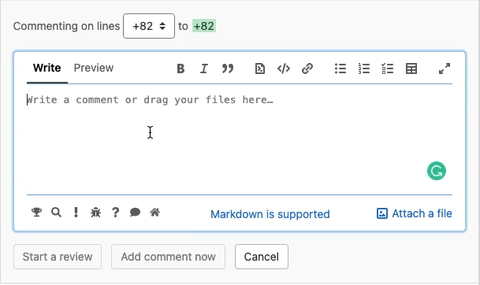

# Emoji Conventional Comments button

This is a fork of [Conventional Comments button](https://gitlab.com/ftechz/conventional-comments-button) which simply adds Emojis to make comments more visual and fun!

> This is a tiny extension that adds a conventional comment button to GitLab file explorer comments, allowing to quickly leave a structured semantic comment during your MR reviews!

## How to enable it on a self-hosted instance

- Open the extension options
- Add your domain as a new line in the "Enabled Hosts" field
- Click Save

## Demo

## Development

First, clone this repo `git clone git@gitlab.com:conventionalcomments/conventional-comments-button.git` and then see below for browser specific instructions.

- On Chrome: Menu
  - More Tools
    - Extensions (be sure to have _Developer Mode_ enabled there)
- In the Extension page: `Load unpacked` and select the cloned repository

## Credits

This project bundles some of the icon coming from [font-awesome](https://fontawesome.com/) icons as SVG
